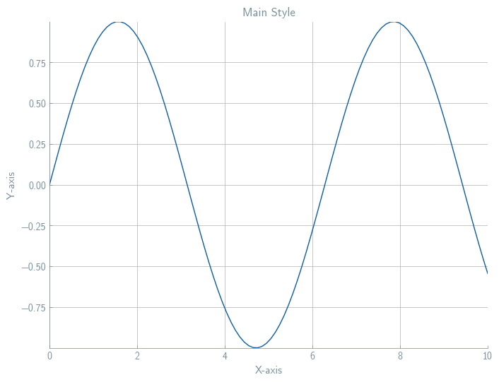
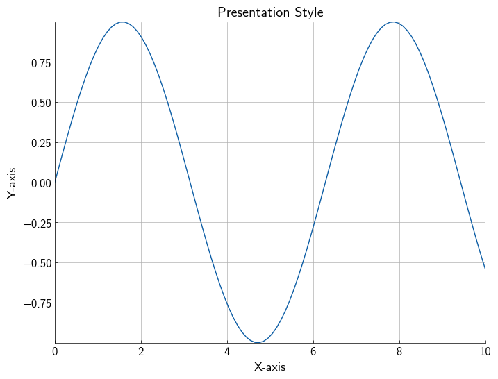
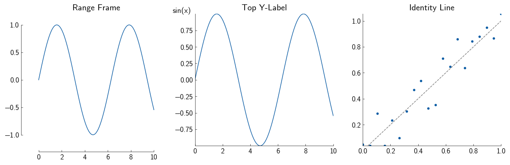

# Lama-Aesthetics

[](https://github.com/lamalab-org/lama-aesthetics/actions/workflows/main.yml?query=branch%3Amain)
[](https://github.com/lamalab-org/lama-aesthetics/blob/main/pyproject.toml)
[](https://lamalab-org.github.io/lama-aesthetics/)
[](https://img.shields.io/github/license/lamalab-org/lama-aesthetics)

Plotting styles and helpers by LamaLab

- **Github repository**: <https://github.com/lamalab-org/lama-aesthetics/>
- **Documentation** <https://lamalab-org.github.io/lama-aesthetics/>

## Installation

```bash
# Clone the repository
git clone https://github.com/lamalab-org/lama-aesthetics.git
cd lama-aesthetics

# Install with uv (recommended)
uv pip install -e .

# Or install with make (which uses uv)
make install
```

## Usage

### Styles

The library provides two main plotting styles:

- **main**: Optimized for publications, reports, and other documents.
- **presentation**: Features larger fonts and thicker lines for better visibility in presentations

```python
import matplotlib.pyplot as plt
import numpy as np
import lama_aesthetics

lama_aesthetics.get_style("main")  # or la.get_style("presentation")
```

<div align="center">
  <div style="display: flex; flex-direction: row;">
    
    
  </div>
  <p><em>Left: Main style; Right: Presentation style</em></p>
</div>

### Helpers

The package includes several plotting utilities to enhance your visualizations:

- **range_frame**: Draws a frame around the data range.
- **ylabel_top**: Places the y-label at the top of the y-axis.
- **add_identity**: Adds a diagonal reference line.

```python
import matplotlib.pyplot as plt
import numpy as np
from lama_aesthetics.plotutils import range_frame, ylabel_top, add_identity

# Create sample data
x = np.linspace(0, 10, 100)
y = np.sin(x)

# Create a figure
fig, axes = plt.subplots(1, 3, figsize=(12, 4))

# Example 1: Range frame - only shows axes within the data range
axes[0].plot(x, y)
range_frame(axes[0], x, y)
axes[0].set_title("Range Frame")

# Example 2: Top Y-label - places ylabel at top of y-axis
axes[1].plot(x, y)
ylabel_top("sin(x)", axes[1])
axes[1].set_title("Top Y-Label")

# Example 3: Identity line - adds a diagonal reference line
x_scatter = np.linspace(0, 1, 20)
y_scatter = x_scatter + 0.1*np.random.randn(20)
axes[2].scatter(x_scatter, y_scatter)
add_identity(axes[2], linestyle="--", color="gray")
axes[2].set_title("Identity Line")

plt.tight_layout()
plt.show()
```

<div align="center">  <p><em>Left: Range Frame; Center: Top Y-Label; Right: Identity Line</em></p> </div>

Repository initiated with [lamalab-org/cookiecutter-uv](https://github.com/lamalab-org/cookiecutter-uv).
