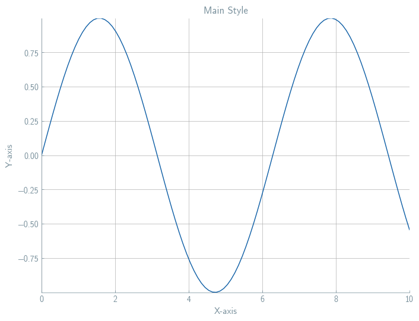
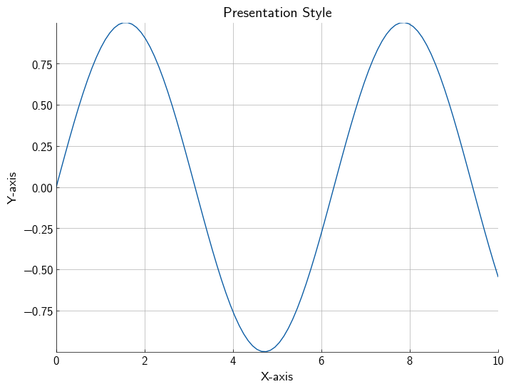
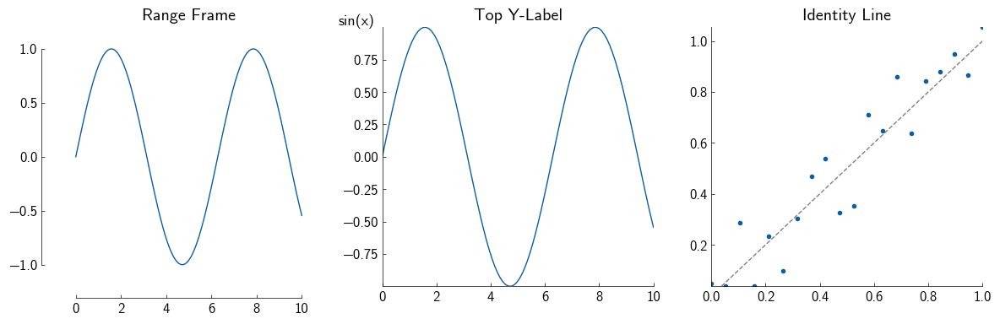

# Lama-Aesthetics

[](https://github.com/lamalab-org/lama-aesthetics/actions/workflows/main.yml?query=branch%3Amain)
[](https://github.com/lamalab-org/lama-aesthetics/blob/main/pyproject.toml)
[](https://lamalab-org.github.io/lama-aesthetics/)
[](https://img.shields.io/github/license/lamalab-org/lama-aesthetics)

Publication-quality plotting styles and helpers for matplotlib by [LamaLab](https://lamalab.org).

- **GitHub repository**: <https://github.com/lamalab-org/lama-aesthetics/>
- **Documentation**: <https://lamalab-org.github.io/lama-aesthetics/>

## Features at a glance

| Category | What you get |
|---|---|
| **Styles** | `main` (publication), `presentation` (talks), `dark` (dark-themed) |
| **Bundled font** | CMU Sans Serif — auto-registered, no system install needed |
| **Range frame** | Tufte-style axis frame trimmed to the data range, with automatic nice-number bounds for numeric axes and full support for categorical axes |
| **Label helpers** | `ylabel_top` — horizontal y-label placed above the top tick |
| **Reference lines** | `add_identity` — dynamic 1:1 diagonal that follows axis changes |
| **Figure decomposition** | `decompose_figure` — split a multi-series figure into one figure per labeled artist |
| **Dimension constants** | `ONE_COL_WIDTH`, `TWO_COL_WIDTH`, `ONE_COL_HEIGHT`, `TWO_COL_HEIGHT` (golden ratio) |

## Installation

```bash
# Clone the repository
git clone https://github.com/lamalab-org/lama-aesthetics.git
cd lama-aesthetics

# Install with uv (recommended)
uv pip install -e .

# Or install with make (which uses uv)
make install
```

## Quick start

```python
import matplotlib.pyplot as plt
import numpy as np
import lama_aesthetics

lama_aesthetics.get_style("main")

fig, ax = plt.subplots()
x = np.linspace(0.5, 9.3, 40)
y = np.sin(x) * 10 + 15

ax.plot(x, y)
lama_aesthetics.range_frame(ax, x, y)       # nice-number axis bounds by default
lama_aesthetics.ylabel_top("y", ax=ax)

plt.show()
```

---

## Styles

The library ships three matplotlib style sheets, all using the bundled **CMU Sans Serif** font:

| Style | Apply with | Description |
|---|---|---|
| **main** | `get_style("main")` | Optimized for single- and two-column journal figures. Compact figure size (3.3 × 2.5 in), inward ticks, thin lines. |
| **presentation** | `get_style("presentation")` | Same layout but with larger fonts (13 / 12 pt) for slides and posters. |
| **dark** | `get_style("dark")` | Black background, white text and lines — ideal for dark-themed slides or dashboards. |

All styles disable the right and top spines, use inward-facing ticks, and remove the legend frame for a clean Tufte-inspired look.

```python
import lama_aesthetics

lama_aesthetics.get_style("main")
# or
lama_aesthetics.get_style("presentation")
# or
lama_aesthetics.get_style("dark")
```

<div align="center">
  <div style="display: flex; flex-direction: row;">
    
    
  </div>
  <p><em>Left: Main style; Right: Presentation style</em></p>
</div>

### Bundled font

The **CMU Sans Serif** font (`cmunss.otf`) is bundled with the package and
registered automatically the first time you apply a style.  You can also
register it manually:

```python
lama_aesthetics.register_fonts()
font_name = lama_aesthetics.get_font_name()   # → "CMU Sans Serif"
```

---

## Plotting utilities

### `range_frame` — Tufte-style range frame with nice-number bounds

`range_frame` trims the axis spines to the data range and offsets them outward
for a clean, separated look.  It automatically detects whether each axis is
**numeric** or **categorical** and handles them differently:

**Numeric axes (default: `nice=True`):**
The spine bounds are snapped to "nice" tick positions (multiples of 1, 2, 2.5,
5, or 10 × 10^n) that bracket the data.  This means the axis line always
starts and ends exactly on a tick mark — no more floating spine endpoints.
Tick positions are computed via matplotlib's `MaxNLocator` and explicitly set
on the axes so there is zero drift between ticks and spine bounds.

**Categorical axes:**
When `x` or `y` contains strings (e.g. `["a", "b", "c"]`), the spine spans
the integer range `0 .. len(values) - 1`.  No rounding is applied.

```python
import matplotlib.pyplot as plt
import numpy as np
from lama_aesthetics.plotutils import range_frame

fig, axes = plt.subplots(1, 3, figsize=(12, 3))

# 1) Basic numeric — bounds snap to nice ticks
x = np.linspace(3.2, 47.8, 20)
y = x * 1.3 - 1.5
axes[0].plot(x, y)
range_frame(axes[0], x, y)                  # nice=True by default
axes[0].set_title("Numeric (nice bounds)")

# 2) Categorical x-axis
categories = ["Model A", "Model B", "Model C", "Model D"]
values = np.array([0.82, 0.91, 0.87, 0.95])
axes[1].plot(categories, values)
range_frame(axes[1], categories, values)    # categorical x, numeric y
axes[1].set_title("Categorical x-axis")

# 3) Disable nice bounds — raw padding only
axes[2].plot(x, y)
range_frame(axes[2], x, y, nice=False, pad=0.05)
axes[2].set_title("nice=False (raw padding)")

plt.tight_layout()
plt.show()
```

#### Parameters

| Parameter | Default | Description |
|---|---|---|
| `ax` | — | Matplotlib `Axes` object |
| `x`, `y` | — | Data arrays (numeric or string/categorical) |
| `pad` | `0.1` | Padding factor applied to both axes. Expressed as a fraction of the spine range; the visible limits extend beyond the spine bounds by this amount. |
| `pad_x` | `None` | Per-axis padding near the x-axis (vertical). Overrides `pad`. |
| `pad_y` | `None` | Per-axis padding near the y-axis (horizontal). Overrides `pad`. |
| `nice` | `True` | Snap numeric spine bounds to nice tick positions that bracket the data. When `False`, spines span the raw data range instead. Padding is always applied regardless of this setting. |

### `ylabel_top` — horizontal y-label above the axis

Places the y-axis label horizontally above the top tick, making it easier to
read without head-tilting:

```python
from lama_aesthetics.plotutils import ylabel_top

fig, ax = plt.subplots()
ax.plot([0, 1, 2], [0, 1, 4])
ylabel_top("Energy (eV)", ax=ax)
```

| Parameter | Default | Description |
|---|---|---|
| `string` | — | Label text |
| `ax` | `None` | Axes (defaults to `plt.gca()`) |
| `x_pad` | `0.01` | Horizontal offset in axes coordinates |
| `y_pad` | `0.02` | Vertical offset above the top tick |

### `add_identity` — dynamic 1:1 reference line

Adds a diagonal identity line that automatically adjusts when the axis limits
change (e.g. during zoom or pan):

```python
from lama_aesthetics.plotutils import add_identity

fig, ax = plt.subplots()
predicted = np.array([1.1, 2.3, 2.9, 4.2])
observed  = np.array([1.0, 2.0, 3.0, 4.0])
ax.scatter(observed, predicted)
add_identity(ax, linestyle="--", color="gray", alpha=0.6)
```

### `decompose_figure` — split a figure by legend entry

Takes a figure (or a single `Axes`) containing multiple labeled series and
returns a list of `(label, figure)` tuples — one separate figure per legend
entry.  This is useful when you want to highlight individual series, e.g. to
include them separately in a paper or presentation.

```python
from lama_aesthetics import decompose_figure, get_style

get_style("main")

fig, ax = plt.subplots()
x = np.linspace(0, 2 * np.pi, 50)
ax.plot(x, np.sin(x), label="sin(x)")
ax.plot(x, np.cos(x), label="cos(x)")
ax.plot(x, np.sin(x) + np.cos(x), label="sin+cos")
ax.set_xlabel("x")
ax.set_ylabel("f(x)")
ax.set_title("Trigonometric Functions")
ax.legend()

parts = decompose_figure(fig)          # also accepts an Axes directly

for label, part_fig in parts:
    part_fig.savefig(f"{label}.png")
    plt.close(part_fig)
```

Each decomposed figure inherits axis labels, title, limits, scale, tick
positions, spine visibility, and grid state from the original.  Pass
`show_legend=False` to omit the legend from the individual figures.

**Supported artist types:** line plots (`plot`), scatter plots (`scatter`),
bar charts (`bar`), and filled regions (`fill_between`).

---

## Figure dimension constants

Predefined sizes based on common journal column widths and the golden ratio:

```python
from lama_aesthetics import (
    ONE_COL_WIDTH,    # 3 inches
    TWO_COL_WIDTH,    # 7.25 inches
    ONE_COL_HEIGHT,   # ONE_COL_WIDTH / φ ≈ 1.854 inches
    TWO_COL_HEIGHT,   # TWO_COL_WIDTH / φ ≈ 4.481 inches
)

fig, ax = plt.subplots(figsize=(ONE_COL_WIDTH, ONE_COL_HEIGHT))
```

---

## Full example

```python
import matplotlib.pyplot as plt
import numpy as np
import lama_aesthetics
from lama_aesthetics.plotutils import range_frame, ylabel_top, add_identity

lama_aesthetics.get_style("main")

x = np.linspace(0, 10, 100)
y = np.sin(x)

fig, axes = plt.subplots(1, 3, figsize=(12, 4))

# Range frame with nice bounds
axes[0].plot(x, y)
range_frame(axes[0], x, y)
axes[0].set_title("Range Frame")

# Top y-label
axes[1].plot(x, y)
ylabel_top("sin(x)", axes[1])
axes[1].set_title("Top Y-Label")

# Identity line
x_sc = np.linspace(0, 1, 20)
y_sc = x_sc + 0.1 * np.random.randn(20)
axes[2].scatter(x_sc, y_sc)
add_identity(axes[2], linestyle="--", color="gray")
axes[2].set_title("Identity Line")

plt.tight_layout()
plt.show()
```

<div align="center">
  
  <p><em>Left: Range Frame; Center: Top Y-Label; Right: Identity Line</em></p>
</div>

---

## API reference

| Function / Constant | Module | Description |
|---|---|---|
| `get_style(name)` | `aesthetics` | Apply a bundled style (`"main"`, `"presentation"`, `"dark"`) |
| `register_fonts()` | `aesthetics` | Register bundled CMU Sans Serif with matplotlib |
| `get_font_name()` | `aesthetics` | Return the registered font family name |
| `range_frame(ax, x, y, ...)` | `plotutils` | Tufte-style range frame with nice-number bounds |
| `ylabel_top(string, ax, ...)` | `plotutils` | Place y-label horizontally above the top tick |
| `add_identity(ax, ...)` | `plotutils` | Add a dynamic 1:1 diagonal reference line |
| `decompose_figure(fig, ...)` | `plotutils` | Split a figure into one figure per labeled artist |
| `ONE_COL_WIDTH` | `aesthetics` | 3 inches |
| `TWO_COL_WIDTH` | `aesthetics` | 7.25 inches |
| `ONE_COL_HEIGHT` | `aesthetics` | `ONE_COL_WIDTH / golden_ratio` |
| `TWO_COL_HEIGHT` | `aesthetics` | `TWO_COL_WIDTH / golden_ratio` |

---

Repository initiated with [lamalab-org/cookiecutter-uv](https://github.com/lamalab-org/cookiecutter-uv).
